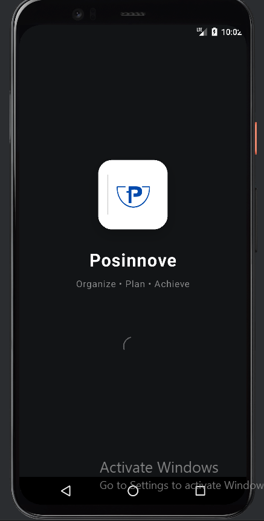
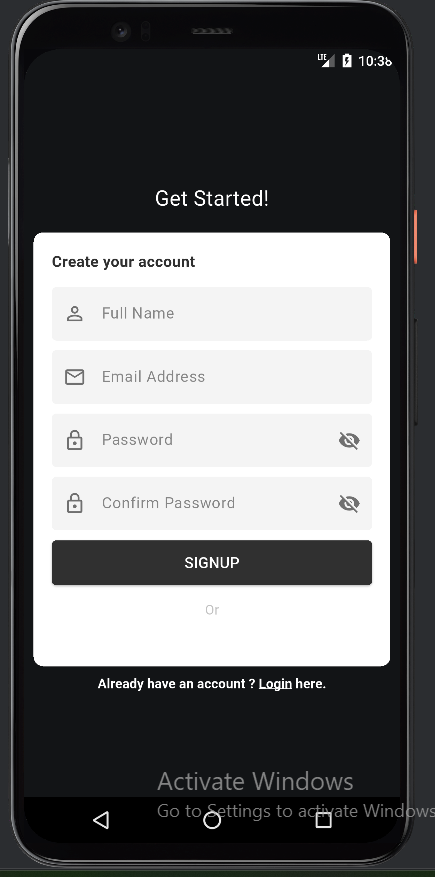
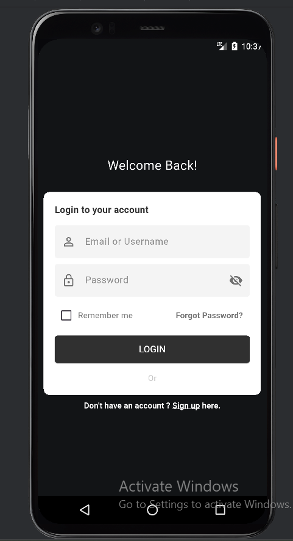
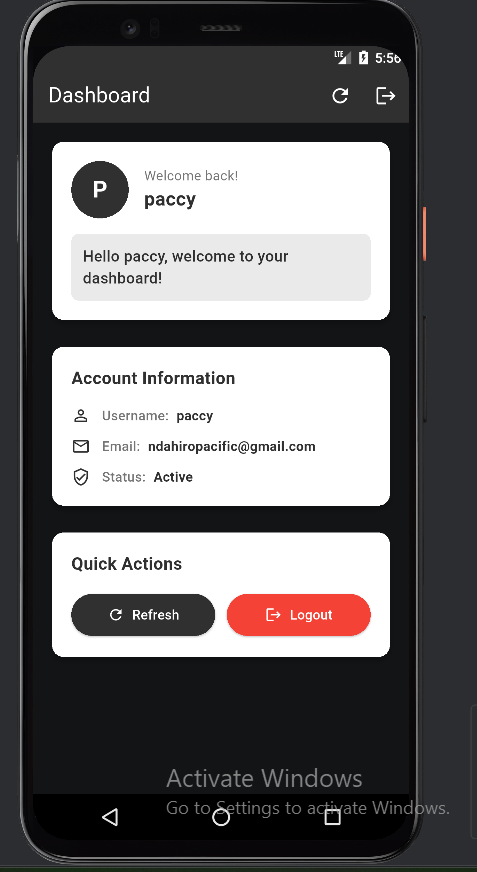

# 📱 Posinnove Task App

A full-stack mobile application built with **Flutter** (frontend) and **Node.js/Express** (backend) featuring user authentication, JWT tokens, and secure data management.

## 🚀 Features

- ✅ **User Registration** - Create new accounts with email validation
- ✅ **User Authentication** - Secure login with JWT tokens  
- ✅ **Password Security** - BCrypt hashing for password protection
- ✅ **Protected Routes** - Dashboard accessible only to authenticated users
- ✅ **Token Management** - Secure token storage and automatic logout
- ✅ **Responsive UI** - Beautiful, modern interface with loading states
- ✅ **Password Strength Indicator** - Real-time password strength validation
- ✅ **Remember Me** - Optional persistent login
- ✅ **Error Handling** - Comprehensive error messages and validation

## 🛠️ Tech Stack

### Frontend (Flutter)
- **Flutter SDK** - Cross-platform mobile development
- **GetX** - State management and navigation
- **HTTP** - API communication
- **SharedPreferences** - Local data storage
- **Material Design** - UI components

### Backend (Node.js)
- **Express.js** - Web application framework
- **MongoDB** - NoSQL database
- **Mongoose** - MongoDB object modeling
- **JWT** - JSON Web Tokens for authentication
- **BCrypt** - Password hashing
- **CORS** - Cross-origin resource sharing

## 📋 Prerequisites

Before running this application, make sure you have the following installed:

- **Flutter SDK** (3.0.0 or higher) - [Install Flutter](https://docs.flutter.dev/get-started/install)
- **Node.js** (16.0 or higher) - [Install Node.js](https://nodejs.org/)
- **MongoDB** - [Install MongoDB](https://docs.mongodb.com/manual/installation/)
- **Android Studio** or **VS Code** with Flutter extensions
- **Git** - Version control

## 📱 Screenshots

### App Flow
<div align="center">
  
  
  
  
</div>

*Complete authentication flow from login to dashboard*

## 🚀 Getting Started

### Step 1: Clone the Repositories

#### Frontend Repository
```bash
git clone https://github.com/Paccyfic/Posinnove_Task_App.git
cd Posinnove_Task_App
```

#### Backend Repository
```bash
git clone https://github.com/Paccyfic/Posinnove_Task_App_Back-end.git
cd Posinnove_Task_App_Back-end
```

### Step 2: Backend Setup

1. **Navigate to the backend directory:**
   ```bash
   cd Posinnove_Task_App_Back-end
   ```

2. **Install dependencies:**
   ```bash
   npm install
   ```

3. **Create environment file:**
   Create a `.env` file in the root directory:
   ```env
   JWT_SECRET=your-super-secret-jwt-key-change-in-production
   MONGODB_URI=mongodb://127.0.0.1:27017/task_app
   PORT=3000
   NODE_ENV=development
   ```

4. **Start MongoDB:**
   ```bash
   # On macOS (using Homebrew)
   brew services start mongodb-community
   
   # On Windows
   net start MongoDB
   
   # On Linux
   sudo systemctl start mongod
   ```

5. **Run the backend server:**
   ```bash
   # Development mode with nodemon
   npm run dev
   
   # Or production mode
   npm start
   ```

   You should see:
   ```
   Server is running on port http://localhost:3000
   Connected to MongoDB
   ```

### Step 3: Frontend Setup

1. **Navigate to the frontend directory:**
   ```bash
   cd Posinnove_Task_App
   ```

2. **Install Flutter dependencies:**
   ```bash
   flutter pub get
   ```

3. **Update API configuration:**
   Open `lib/controllers/auth_controller.dart` and update the base URL if needed:
   ```dart
   // For Android Emulator
   static const String baseUrl = 'http://10.0.2.2:3000/api';
   
   // For iOS Simulator
   static const String baseUrl = 'http://localhost:3000/api';
   
   // For Physical Device (replace with your computer's IP)
   static const String baseUrl = 'http://192.168.1.XXX:3000/api';
   ```

4. **Run the Flutter application:**
   ```bash
   # Make sure you have an emulator running or device connected
   flutter devices
   
   # Run the app
   flutter run
   ```

## 📝 API Endpoints

### Authentication Routes
- `POST /api/registration` - Register a new user
- `POST /api/login` - User login
- `GET /api/profile` - Get user profile (Protected)
- `GET /api/dashboard` - Get dashboard data (Protected)

### Request/Response Examples

#### Registration
```json
// POST /api/registration
{
  "username": "John Doe",
  "email": "john@example.com",
  "password": "SecurePass123!"
}

// Response
{
  "status": true,
  "message": "User registered successfully",
  "data": {
    "user": {
      "id": "user_id",
      "username": "John Doe",
      "email": "john@example.com"
    },
    "token": "jwt_token_here"
  }
}
```

#### Login
```json
// POST /api/login
{
  "email": "john@example.com",
  "password": "SecurePass123!"
}

// Response
{
  "status": true,
  "message": "Login successful",
  "data": {
    "user": {
      "id": "user_id",
      "username": "John Doe",
      "email": "john@example.com"
    },
    "token": "jwt_token_here"
  }
}
```

## 🏗️ Project Structure

### Frontend Structure
```
lib/
├── controllers/
│   └── input_validators.dart
│   └── auth_controllers.dart
├── screens/
│   ├── login.dart
│   ├── sign_up.dart
│   └── dashboard.dart
├── utils/
│   └── mytheme.dart
└── main.dart
```

### Backend Structure
```
├── config/
│   └── database.js
├── controller/
│   └── user_controller.js
├── middleware/
│   └── auth_middleware.js
├── model/
│   └── user_model.js
├── routes/
│   └── user_router.js
├── services/
│   └── user_service.js
├── app.js
└── index.js
```

## 🔧 Configuration

### Environment Variables

#### Backend (.env)
```env
JWT_SECRET=your-jwt-secret-key
MONGODB_URI=mongodb://127.0.0.1:27017/task_app
PORT=3000
NODE_ENV=development
```

### Flutter Configuration

#### Android (android/app/src/main/AndroidManifest.xml)
Add internet permission:
```xml
<uses-permission android:name="android.permission.INTERNET" />
```

#### Network Security (android/app/src/main/res/xml/network_security_config.xml)
For development with local server:
```xml
<?xml version="1.0" encoding="utf-8"?>
<network-security-config>
    <domain-config cleartextTrafficPermitted="true">
        <domain includeSubdomains="true">10.0.2.2</domain>
        <domain includeSubdomains="true">localhost</domain>
        <domain includeSubdomains="true">192.168.1.0/24</domain>
    </domain-config>
</network-security-config>
```

## 🧪 Testing

### Test User Credentials
You can create test users through the registration screen or use these sample credentials after running the app:

```
Email: test@example.com
Password: TestPass123!
```

### API Testing with Postman
1. Import the API endpoints into Postman
2. Test registration endpoint
3. Test login endpoint  
4. Use the returned JWT token for protected routes

## 🐛 Troubleshooting

### Common Issues

#### 1. Cannot connect to backend
- **Issue**: Network error when calling APIs
- **Solution**: 
  - Ensure backend server is running on port 3000
  - Check the base URL in `auth_service.dart`
  - For Android emulator, use `10.0.2.2` instead of `localhost`
  - For physical devices, use your computer's IP address

#### 2. MongoDB connection failed
- **Issue**: Backend can't connect to MongoDB
- **Solution**:
  - Ensure MongoDB is running
  - Check connection string in `.env` file
  - Verify MongoDB is accessible on port 27017

#### 3. JWT token issues
- **Issue**: Protected routes return 401 errors
- **Solution**:
  - Check if token is properly stored in SharedPreferences
  - Verify token format in Authorization header
  - Ensure JWT secret matches between frontend and backend

#### 4. CORS errors
- **Issue**: Browser blocks requests due to CORS policy
- **Solution**:
  - Verify CORS is configured in `app.js`
  - Add your frontend URL to allowed origins

## 🚀 Deployment

### Backend Deployment (Heroku/Railway/DigitalOcean)
1. Set environment variables in your hosting platform
2. Update MongoDB connection to cloud database (MongoDB Atlas)
3. Update CORS origins for production

### Frontend Deployment
1. Build APK for Android:
   ```bash
   flutter build apk --release
   ```

2. Build for iOS:
   ```bash
   flutter build ios --release
   ```

## 🤝 Contributing

1. Fork the repositories
2. Create a feature branch (`git checkout -b feature/AmazingFeature`)
3. Commit your changes (`git commit -m 'Add some AmazingFeature'`)
4. Push to the branch (`git push origin feature/AmazingFeature`)
5. Open a Pull Request

## 📄 License

This project is licensed under the MIT License - see the [LICENSE](LICENSE) file for details.

## 👨‍💻 Author

**Paccyfic**
- GitHub: [@Paccyfic](https://github.com/Paccyfic)
- Frontend Repository: [Posinnove_Task_App](https://github.com/Paccyfic/Posinnove_Task_App)
- Backend Repository: [Posinnove_Task_App_Back-end](https://github.com/Paccyfic/Posinnove_Task_App_Back-end)

## 📞 Support

If you have any questions or need help getting started, please open an issue in the respective repository:
- [Frontend Issues](https://github.com/Paccyfic/Posinnove_Task_App/issues)
- [Backend Issues](https://github.com/Paccyfic/Posinnove_Task_App_Back-end/issues)

---

⭐ **Star this repository if you found it helpful!**